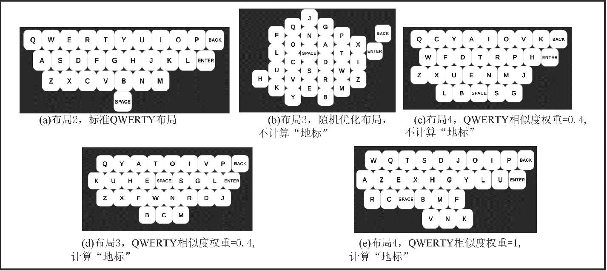
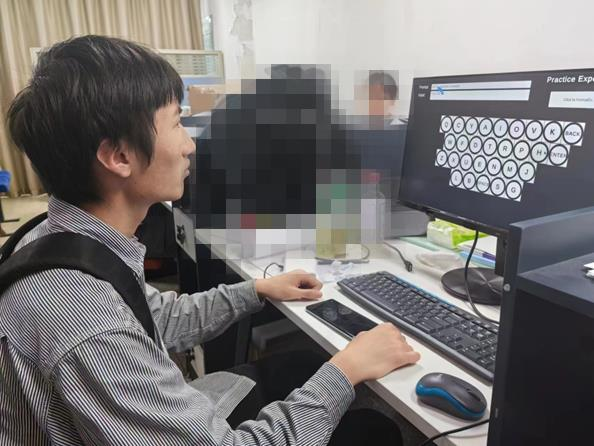
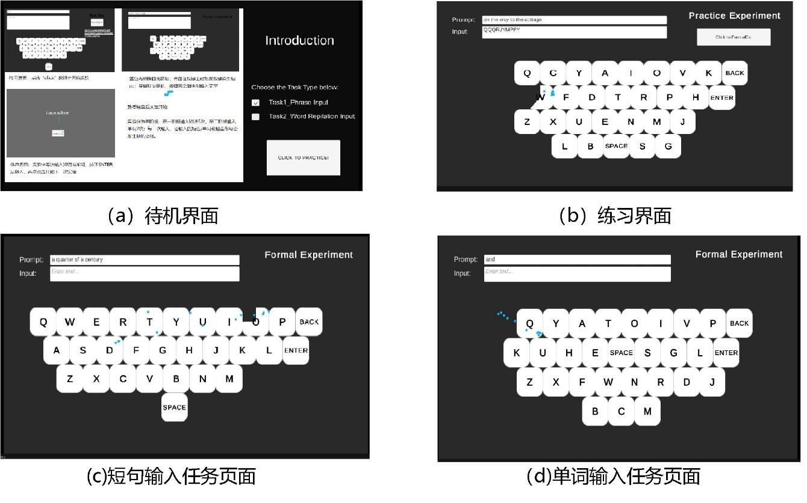

## Introduction

Using eye-tracking for typing is like clicking keys one by one with a single finger. We were curious about whether the keyboard layout (especially its similarity to the QWERTY layout) would affect typing performance.

Inspired by some papers related to the Quantitative Design of Virtual Keyboard Layout [^1] [^2] [^3] by Prof. Shumin Zhai, we conducted Monte Carlo simulations to create 5 virtual keyboard layouts with varying degrees of similarity to the QWERTY layout. 

We designed two typing tasks, "Word Input" and "Phrase Input," and invited 15 participants to take part in the experiment. The results indicate that the more similar a layout is to the QWERTY layout, the better the users' performance, regardless of whether they are beginners or experts in eye-tracking devices.

As the project leader, I collaborated with an undergraduate student, and my main responsibilities included:
- Generating the project idea and developing the research scheme.
- Assisting in proposing the layout generation algorithm based on the Monte Carlo Method.
- Creating an experimental platform using Unity and the Tobii Eye Tracker API.
- Guiding the undergraduate student in conducting experiments and analyzing the results through SPSS.

---

### Reference

[^1]: Zhai, S., Hunter, M., & Smith, B. A. (2000, November). The metropolis keyboard-an exploration of quantitative techniques for virtual keyboard design. In Proceedings of the 13th annual ACM symposium on User interface software and technology (pp. 119-128).

[^2]: Bi, X., Smith, B. A., & Zhai, S. (2010, April). Quasi-qwerty soft keyboard optimization. In Proceedings of the SIGCHI Conference on Human Factors in Computing Systems (pp. 283-286).

[^3]: Bi, X., & Zhai, S. (2016, May). IJqwerty: What difference does one key change make? Gesture typing keyboard optimization bounded by one key position change from Qwerty. In Proceedings of the 2016 CHI Conference on Human Factors in Computing Systems (pp. 49-58).

---
