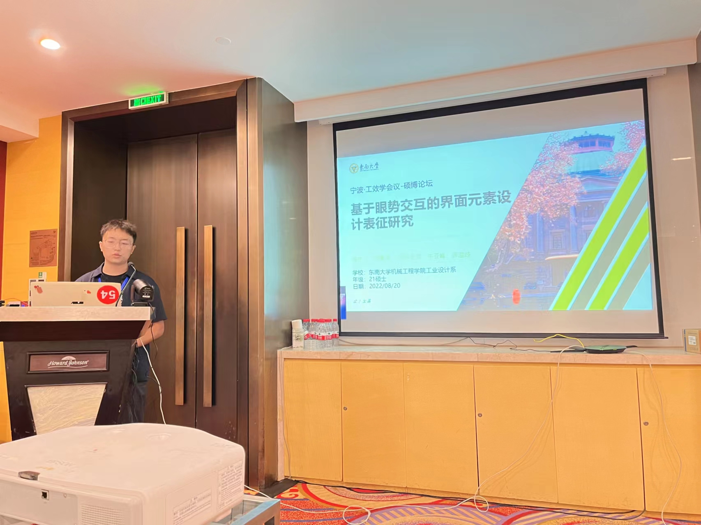

# Introduction

Under the supervision of [Prof. Yafeng Niu](https://me.seu.edu.cn/nyf_31777/list.htm), my undergraduate thesis project involves the development of a Fitts' Law-based ergonomic experiment platform. Additionally, I have designed a within-subject experiment with three factors and recruited 20 participants to conduct it using this platform.

My responsibilities include:
● Building the experimental platform using Unity and the Tobii SDK for Unity.
● Incorporating the following features into the experimental platform:
  ○ Experiment workflow configuration
  ○ Data collection
  ○ Data export
  ○ User data recording

Currently, this experimental platform, including subsequent iterations and optimizations, has supported the execution of two undergraduate theses, two master's theses, and two journal papers.

By the way, I also presented this project at [the 2nd Chinese Society of Human Factors in Design and the 21st International Conference on Management Ergonomics](https://mp.weixin.qq.com/s/dsli6iNf89vbVmiW62uutA).

# Video Showcase

<video src="Example.mp4" controls title="Title"></video>
---

