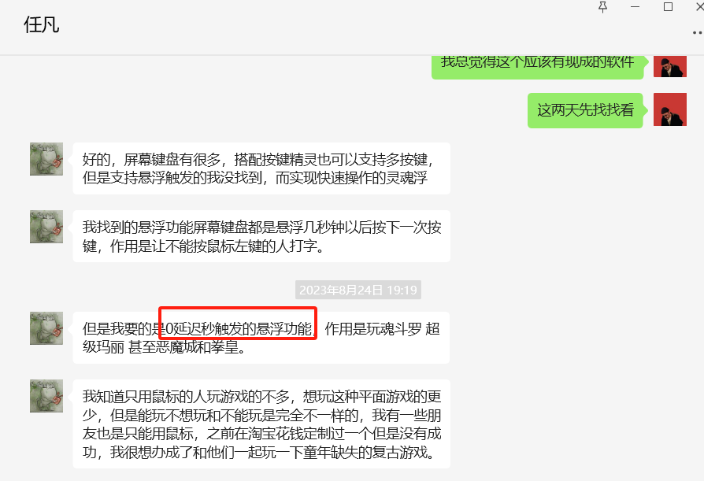
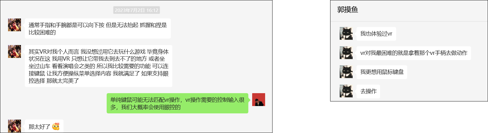

# Achievements:

- With the guidance of [Prof. Mingming Fan](https://www.mingmingfan.com/), I led a research team and conducted a user study aimed at improving VR accessibility for people with motor impairments, specifically those with Spinal Muscular Atrophy, using **participatory design**.

- As the **first author**, my paper titled "**Designing Gaze-Assisted Upper-Body Gesture Interaction with and for People with Spinal Muscular Atrophy in VR**" has been submitted to **CHI'24**.

---

# Main Gains from the Project:

1. I learned a new qualitative study method: User-centered design. Additionally, through interviewing for **over 24 hours** (12 participants * 2 hours), I fully learned how to explore demands from what people are saying and how to code and analyze the thinking from interview recordings.

2. I obtained connections with two disability advocacy organizations, one is [the Meier Advocacy & Support Center for SMA 美儿SMA关爱中心](http://www.meier.org.cn/), and another is [Guangzhou Rare Disease Care Center 广州众援力罕见病关爱中心](https://weibo.com/748287897). The core members of these organizations encourage me to continue my research in the future. Besides, I connected with **more than 50 people** with motor impairments, most of them have SMA, and others have ASL, cerebral palsy, etc. Based on these connections, I am motivated to do some research about improving VR/AR accessibility for people with motor impairments.

3. Through our research, I fully participated in understanding how people with motor impairments want to interact with VR devices and found some potential research directions as well. I summarized them as follows.

---

# Future research direction:

I raised two research ideas as the extension of the accomplished user study

1. **A context-aware interface to automatically adjust which muscle should be used**

Many people with SMA mentioned the trade-off between the sense of experience and performance:
- While playing VR games, they prefer to use their stronger muscles to achieve better performance.
- When relaxing (e.g., watching VR movies), they prefer to use weaker muscles for exercises.

It is essential to propose an automatic interface to help them balance the sense of experience and performance while using VR.

2. **Designing Micro-gestures for commands input**

Some people with severe SMA cannot perform wide-range movements to interact with computing devices. They wish to use micro-gestures (e.g., slight wrist swipes) for VR input. Therefore, we could model their micro-gestures or use computer vision to detect them to facilitate computer interaction.

---

While communicating with some people with motor impairments, I also gathered valuable research insights.

3. **A Customized Interface for Fast or Simultaneous Input**

One participant with severe motor impairments who enjoys playing computer games often combines VoiceAttack (a voice-controlled software used to input computer commands as an alternative to a keyboard) with a mouse. 

He also recorded how he plays computer games with this combination. However, it is challenging for him to achieve 
zero-delay manipulation or simultaneously press multiple keys. 
  - [Showcase of how he plays computer game](https://www.bilibili.com/video/BV1Gh4y1e7f8/?share_source=copy_web&vd_source=c47b872edab8f4eba8985b2299845bc9)

One solution he proposed is to create some customized keys that can trigger multiple key presses simultaneously. Other solutions could be explored in the future.

4. **Using traditional input solutions in VR**

When discussing the use of VR, more than three people with motor impairments mentioned that the most suitable **VR input method** for them is using a **mouse and keyboard**, as well as some **touchscreens**. 

Since there has been research[^1] exploring how to use a phone to manipulate in VR, I am highly motivated to conduct further research in this area in the future!

[^1]: Kari, M., & Holz, C. (2023, April). HandyCast: Phone-based Bimanual Input for Virtual Reality in Mobile and Space-Constrained Settings via Pose-and-Touch Transfer. In Proceedings of the 2023 CHI Conference on Human Factors in Computing Systems (pp. 1-15).

5. **Improvement of Quadstick**

There is a mouth-controlled input device named Quadstick, which is often used by many individuals with disabilities who have difficulty using their hands to interact with computers. 

Although it can provide sufficient performance if users are familiar with it, some users mentioned that it is **too difficult to learn**, especially for older individuals, and **it often breaks**. Therefore, it is significant to find ways to address these issues.

---

