"TIMER" is a smart ring that allows users to record their activities wherever and whenever they like. Like other commercial wearables (e.g. smart wrist), it worked with an application on mobile phone.

Tools:
- Modeling and rendering: **Blender**
- Logo design: **Adobe Illustrator (AI)**
- UI design: **Figma**

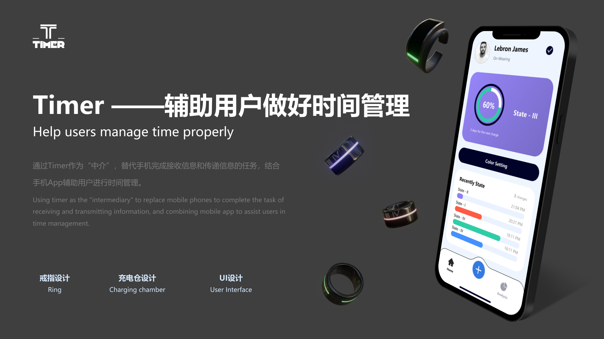 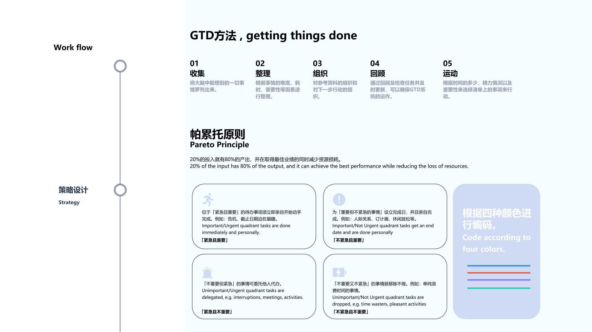 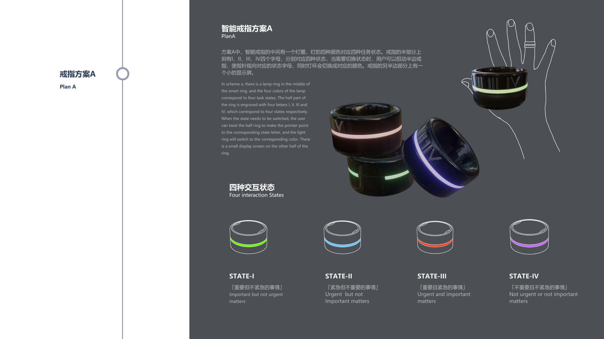 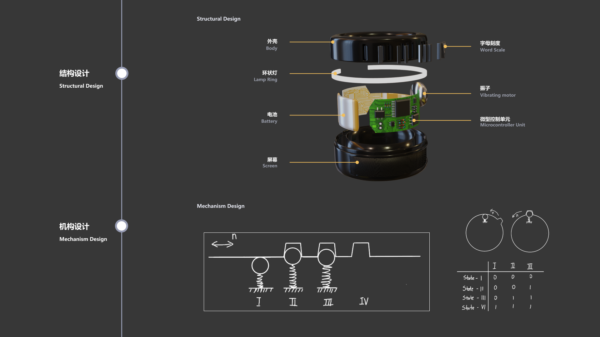 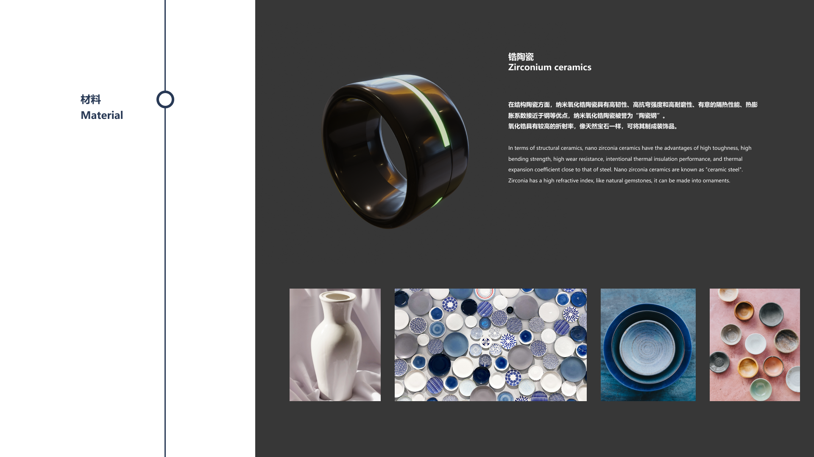 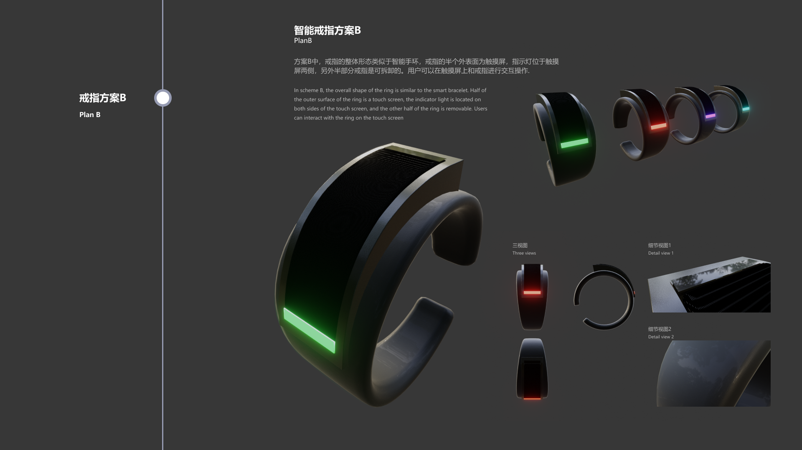 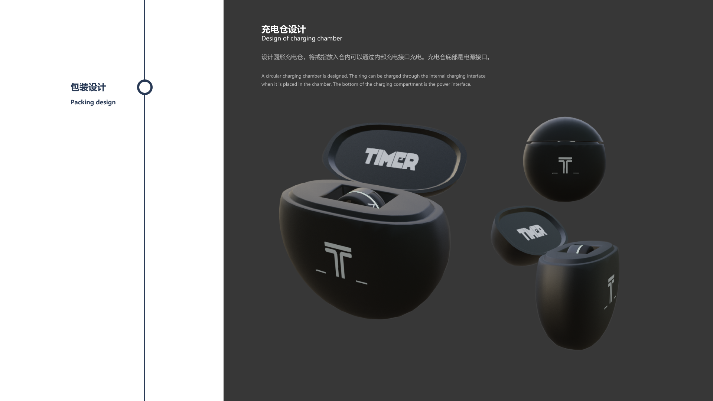 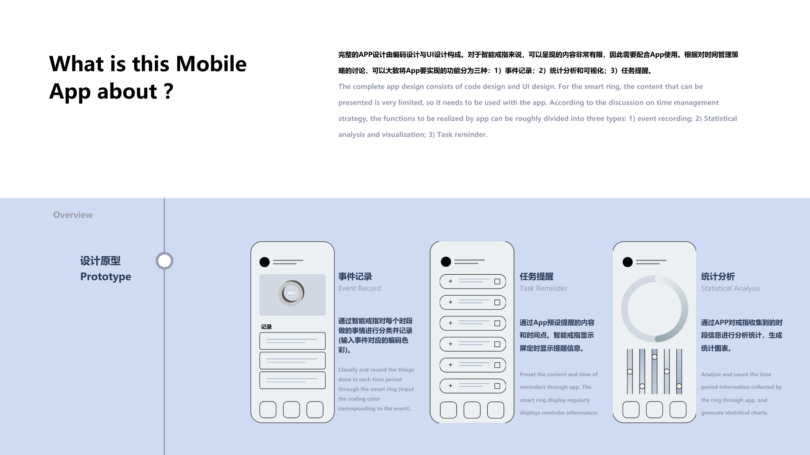 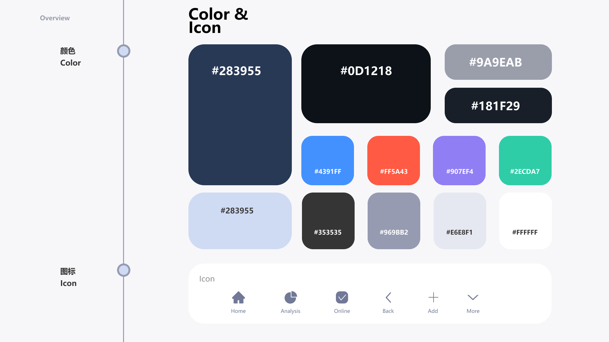 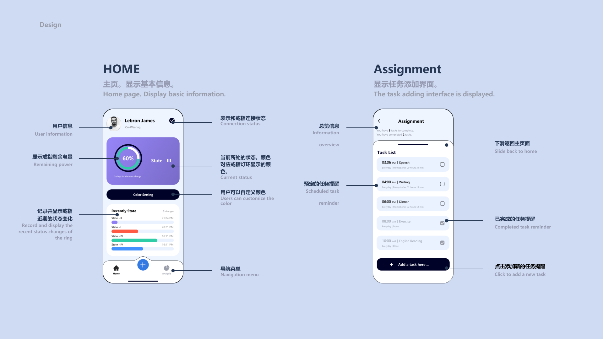 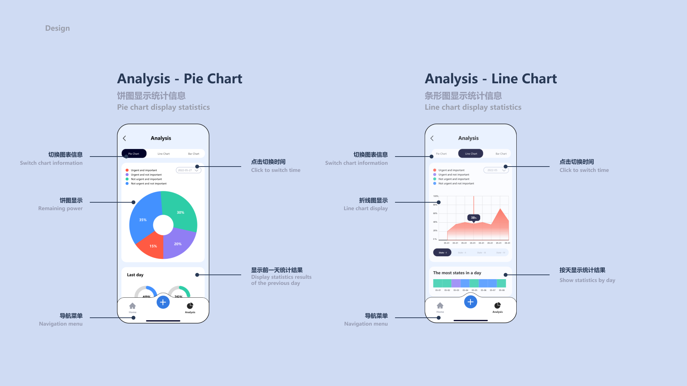 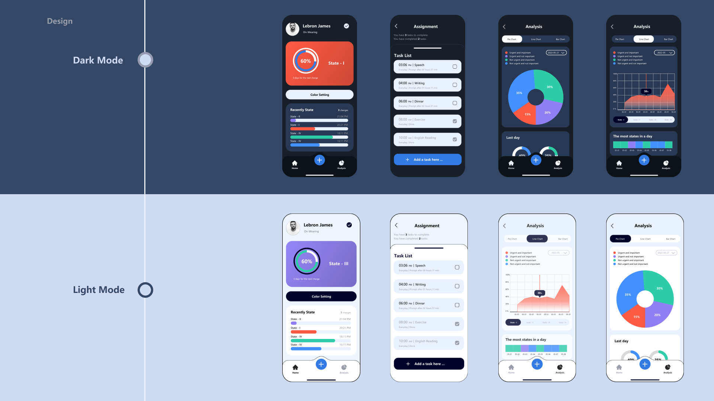

---

