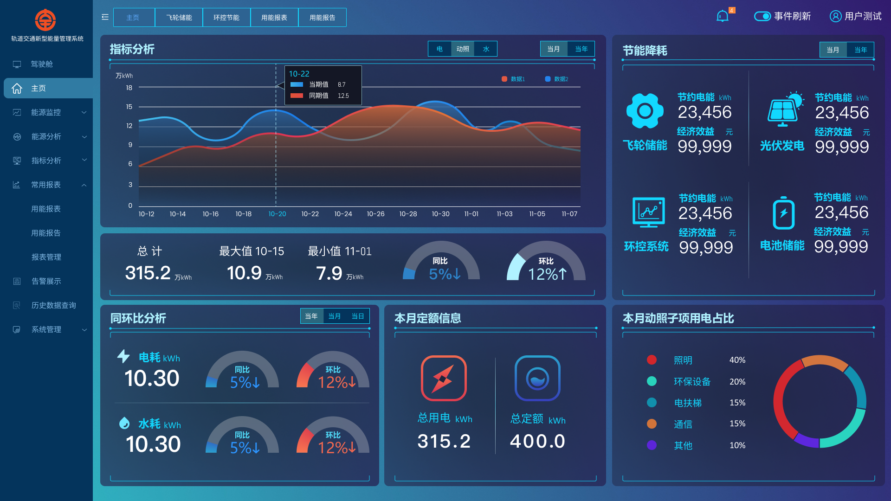

I participated in the projects that involved designing the user interface for [Daquan Company](https://www.daqo.com/Child/company/id/907.html)'s industrial park management system using Figma, creating over 30 webpages, and delivering them to frontend engineers.

Note: The complete webpages have been used, and here are two examples.

 

---

