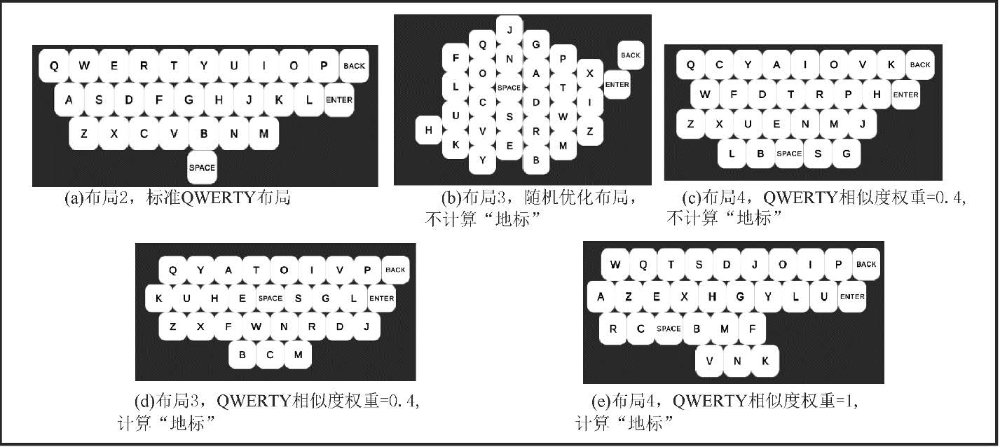
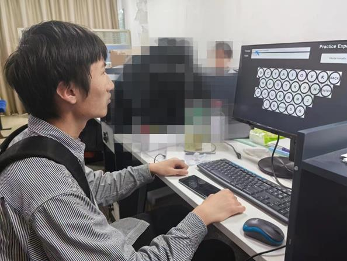
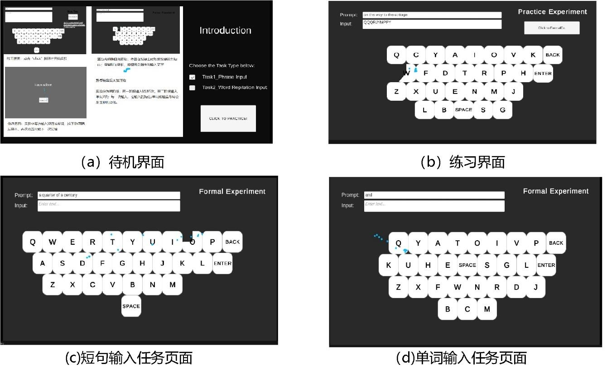

## 简介

用眼动进行打字，就像用一根手指逐个点按按键。我们好奇键盘布局（尤其是与 QWERTY 布局的相似度）是否会影响输入表现。

受翟振明教授等人关于虚拟键盘布局定量设计的研究启发[^1] [^2] [^3]，我们通过蒙特卡洛模拟生成了 5 种与 QWERTY 相似度不同的虚拟键盘布局。

我们设计了“单词输入”与“短语输入”两项打字任务，并邀请 15 名被试参与实验。结果表明：无论初学者还是眼动设备熟练用户，布局越接近 QWERTY，表现越好。

作为项目负责人，我与一名本科生合作，主要职责包括：
- 提出项目想法并制定研究方案。
- 协助提出基于蒙特卡洛方法的布局生成算法。
- 使用 Unity 与 Tobii Eye Tracker API 搭建实验平台。
- 指导本科生开展实验，并用 SPSS 分析结果。

---

### 参考文献

[^1]: Zhai, S., Hunter, M., & Smith, B. A. (2000, November). The metropolis keyboard-an exploration of quantitative techniques for virtual keyboard design. In Proceedings of the 13th annual ACM symposium on User interface software and technology (pp. 119-128).

[^2]: Bi, X., Smith, B. A., & Zhai, S. (2010, April). Quasi-qwerty soft keyboard optimization. In Proceedings of the SIGCHI Conference on Human Factors in Computing Systems (pp. 283-286).

[^3]: Bi, X., & Zhai, S. (2016, May). IJqwerty: What difference does one key change make? Gesture typing keyboard optimization bounded by one key position change from Qwerty. In Proceedings of the 2016 CHI Conference on Human Factors in Computing Systems (pp. 49-58).

---
