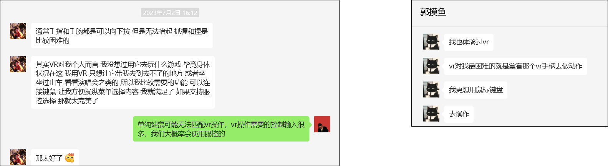
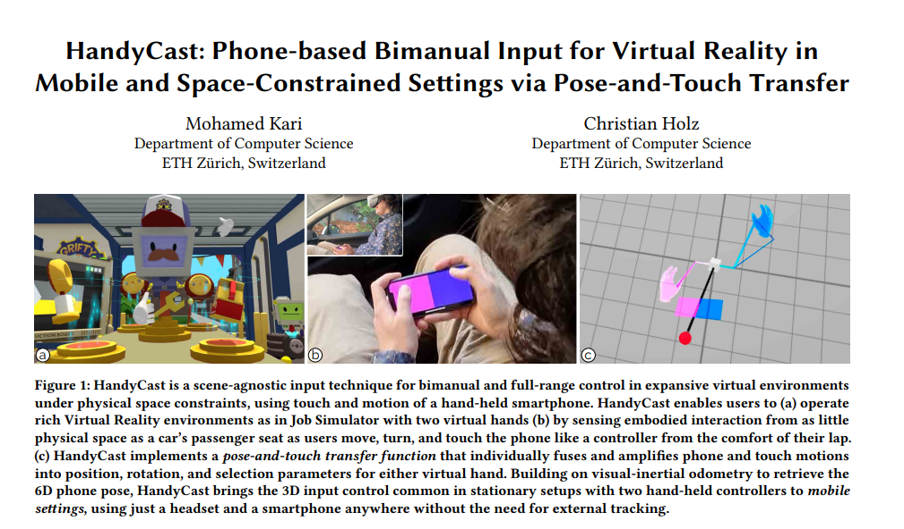
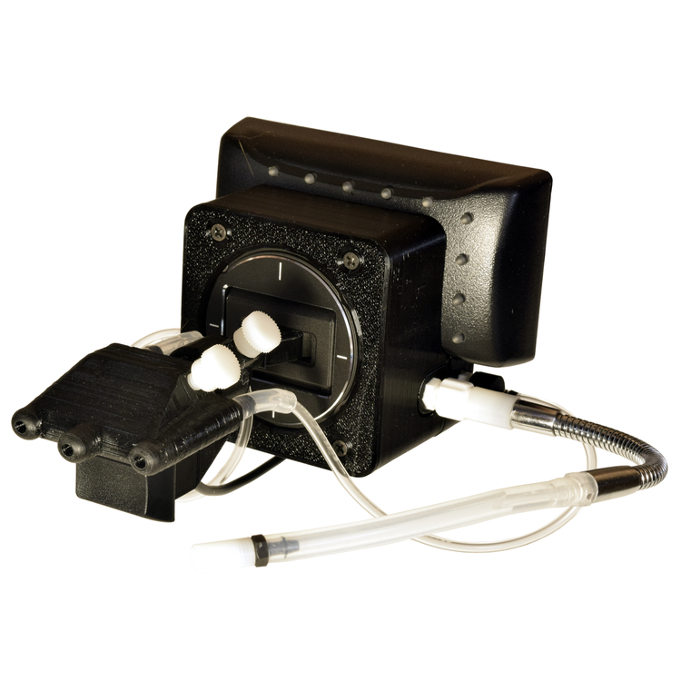

# 成果：

- 在[樊明明教授](https://www.mingmingfan.com/)指导下，我带领研究团队开展用户研究，面向运动障碍人群（尤其是脊髓性肌萎缩症 SMA 患者），采用**参与式设计**提升 VR 无障碍性。

- 作为**第一作者**，论文 "**Designing Upper-Body Gesture Interaction with and for People with Spinal Muscular Atrophy in VR**" 发表于 **CHI'24**（[DOI](https://doi.org/10.1145/3613904.3642884)）。

---

# 项目主要收获：

1. 我学习了新的定性研究方法：以用户为中心的设计。通过累计超过 **24 小时**的访谈（12 名被试 × 2 小时），充分学习了如何从话语中挖掘需求，并对访谈录音进行编码与分析。

2. 我与两家残障倡导组织建立了联系：一是[美儿 SMA 关爱中心](http://www.meier.org.cn/)，二是[广州众援力罕见病关爱中心](https://weibo.com/748287897)。这些组织的核心成员鼓励我继续相关研究方向。此外，我还联系了 **50 余位**运动障碍人士，其中多数为 SMA，也有 ALS、脑瘫等。基于这些联系，我更有动力继续开展面向运动障碍人群的 VR/AR 无障碍研究。

3. 通过研究，我深入理解了运动障碍人士希望如何与 VR 设备交互，并整理出一些潜在研究方向，如下所述。

---

# 未来研究方向：

作为已完成用户研究的延伸，我提出了两个研究想法：

1. **情境感知界面：自动调节应使用哪块肌肉**

许多 SMA 患者提到体验感与表现之间的权衡：
- 玩 VR 游戏时，他们更倾向使用更强的肌肉以获得更好表现。
- 放松时（如观看 VR 电影），他们更倾向使用较弱肌肉进行锻炼。

因此，有必要提出一种自动界面，帮助他们在使用 VR 时平衡体验感与表现。

2. **面向指令输入的微手势设计**

部分重度 SMA 患者无法完成大幅度动作来与计算设备交互。他们希望用微手势（如轻微腕部滑动）进行 VR 输入。因此，可以对微手势建模，或用计算机视觉进行检测，以支持交互。

---

在与部分运动障碍人士交流时，我也收集到有价值的研究洞察。

3. **面向快速或同时输入的定制化界面**

一位重度运动障碍、喜欢玩电脑游戏的参与者，经常将 VoiceAttack（语音控制软件，用于输入电脑指令以替代键盘）与鼠标结合使用。

他还录制了用该组合玩游戏的过程。但对他而言，实现零延迟操作或同时按下多个按键仍然困难。
  - [他玩游戏的展示视频](https://www.bilibili.com/video/BV1Gh4y1e7f8/?share_source=copy_web&vd_source=c47b872edab8f4eba8985b2299845bc9)

他提出的一种方案是创建可同时触发多个按键的定制键。未来还可以探索其他方案。

4. **在 VR 中使用传统输入方案**

讨论 VR 使用时，超过三位运动障碍人士提到，对他们最合适的 **VR 输入方式**是 **鼠标与键盘**，以及一些**触摸屏**。

由于已有研究[^1]探索如何用手机在 VR 中进行操作，我非常有动力在这一方向继续研究！

[^1]: Kari, M., & Holz, C. (2023, April). HandyCast: Phone-based Bimanual Input for Virtual Reality in Mobile and Space-Constrained Settings via Pose-and-Touch Transfer. In Proceedings of the 2023 CHI Conference on Human Factors in Computing Systems (pp. 1-15).

5. **改进 Quadstick**

有一种口控输入设备名为 Quadstick，常被许多难以用手操作电脑的残障人士使用。

尽管熟练用户可以获得足够性能，但有人提到它**太难学习**（尤其对年长者），且**经常损坏**。因此，寻找解决这些问题的方法很有意义。

---
